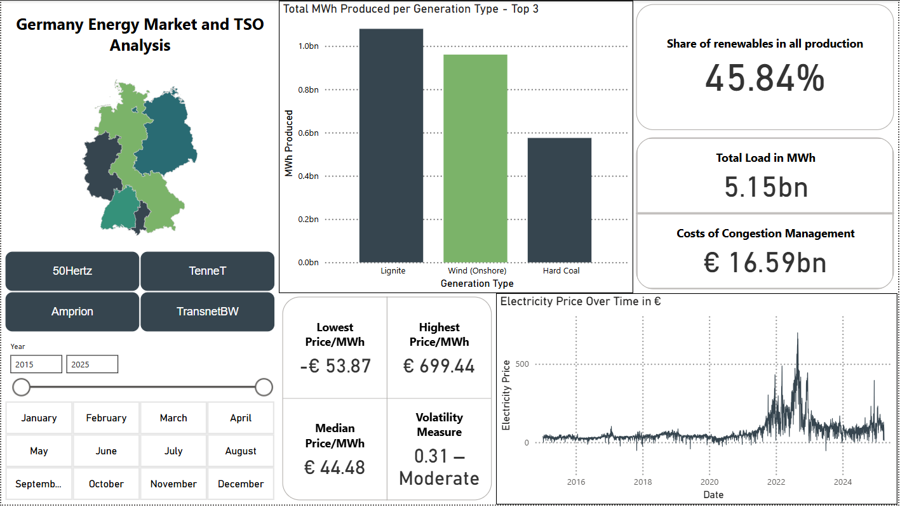
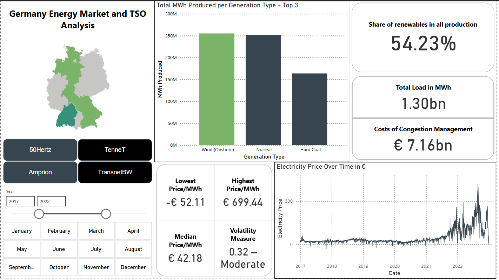

# Power BI Dashboard — German Energy Market

This folder contains the interactive Power BI dashboard built for visualizing key aspects of the German electricity market. It connects to a PostgreSQL database containing structured and cleaned data downloaded from SMARD.de.

---

## Files

- `EnergyDashboard.pbix`  
  The full Power BI dashboard with data snapshot included.

- `EnergyDashboardTemplate.pbit`  
  A clean Power BI template that retains all visuals, measures, filters, and structure, but does not include any data. Use this to connect to your own PostgreSQL instance.

- `screenshots/`  
  Contains 5 preview images of the dashboard for quick reference without opening the Power BI files.

---

## Dashboard Overview

The dashboard enables analysis across four German control zones:

- **50Hertz**
- **Amprion**
- **TenneT**
- **TransnetBW**

It provides insights on:

- Monthly electricity generation by source
- Total system load per zone
- Redispatch and congestion management costs
- Day-ahead electricity prices
- Price volatility and classification

---

## Example Visuals

Below are previews of selected dashboard elements:

(Additional screenshots are included in the `screenshots/` folder.)

---

## Using the Template

1. Open `de_energy_dashboard.pbit` in Power BI.
2. When prompted, enter your PostgreSQL connection information:
   - Server
   - Port (`5432`)
   - Database (e.g. `energy_data`)
   - Username(usually postgres) / Password
3. Data will load automatically, and visuals will update accordingly.

---

## Notes

- This dashboard is fully dynamic and responds to slicers for:
  - Control zone
  - Year
  - Month
- All backend data is sourced from a normalized SQL schema populated using the main Python pipeline in this project.

---